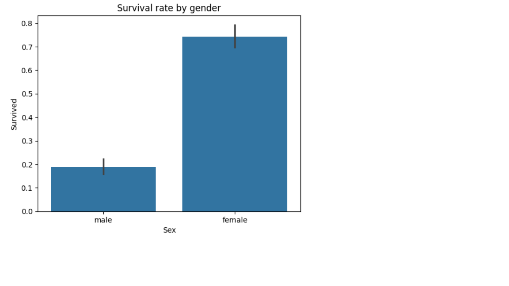

# Titanic Data Analysis

An exploratory data analysis of Titanic passenger data using Python to investigate survival patterns.

## Overview
This project uses Python, Pandas, Matplotlib, and Seaborn to analyze Titanic passenger survival rates. The results were exported to Excel.

## Files
- `titanic_analysis.ipynb`: Jupyter Notebook with code and visualizations.
- `train.csv`: Input data from Kaggle.
- `titanic_output.xlsx`: Cleaned and analyzed data as an Excel file.

## Analyses
- Survival rate by gender, class, and embarkation location.
- Age distribution (histogram).
- Fare distribution (boxplot).
- Median correction for missing age values.

## Key Findings
- Women and first-class passengers had the highest survival rates.
- Higher fares correlate with better survival chances.
- Passengers from Cherbourg (C) survived more often than those from Southampton (S).

## Tools
- **Programming**: Python, Pandas, Matplotlib, Seaborn
- **Export**: Openpyxl for Excel

## Next steps
- Interactive dashboard in Google Looker Studio (in progress).

## Example Visualization

## Dashboard
[View the interactive Titanic Survival Dashboard](https://lookerstudio.google.com/reporting/76f41269-82c4-48e8-bada-490bcd891f87)

## Dashboard
[View the interactive Titanic Survival Dashboard](https://lookerstudio.google.com/reporting/76f41269-82c4-48e8-bada-490bcd891f87)

